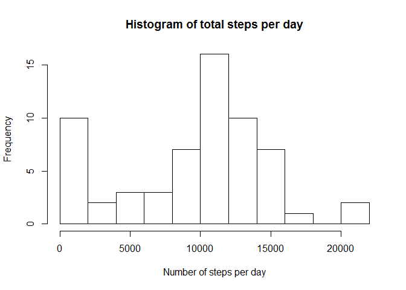
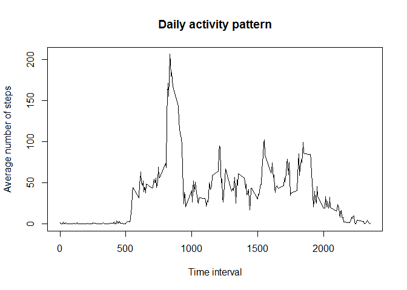
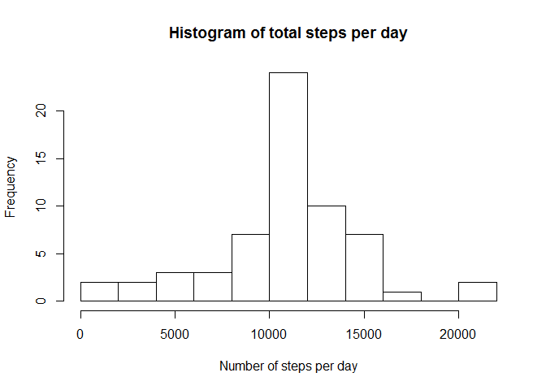
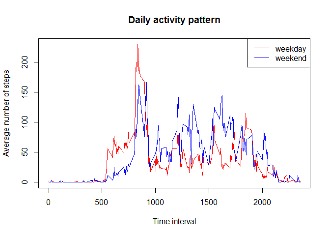

Data are collected from a personal activity monitoring device. This device collects data at 5 minute intervals through out the day for two months. The Data include the number of steps taken in 5 minute intervals each day by an anonymous individual.

The variables included are:

* steps: Number of steps taking in a 5-minute interval (missing values are coded as NA)

* date: The date on which the measurement was taken in YYYY-MM-DD format

* interval: Identifier for the 5-minute interval in which measurement was taken


### Loading and preprocessing the data

First read in the data from csv format: 

```r
setwd("~/Monique/Reproducible Research")
```


```r
unzip(zipfile="activity.zip")
data <- read.csv("activity.csv")
summary(data)
```

     steps                date          interval     
 Min.   :  0.00   2012-10-01:  288   Min.   :   0.0  
 1st Qu.:  0.00   2012-10-02:  288   1st Qu.: 588.8  
 Median :  0.00   2012-10-03:  288   Median :1177.5  
 Mean   : 37.38   2012-10-04:  288   Mean   :1177.5  
 3rd Qu.: 12.00   2012-10-05:  288   3rd Qu.:1766.2  
 Max.   :806.00   2012-10-06:  288   Max.   :2355.0  
 NA's   :2304     (Other)   :15840                   


### What is mean total number of steps taken per day?

To calculate te total number of steps taken per day, we sum up the steps using sapply. A histogram is drawn to give an overview of the total number of steps taken for each of the days. 


```r
data_per_day <- split(data, data$date)
steps_per_day <- sapply(data_per_day, function(x) sum(x[complete.cases(x) , 1]))
hist(steps_per_day, breaks=10, xlab="Number of steps per day", main="Histogram of total steps per day")
```

<!-- -->

Furthermore, the mean was determined at:

```r
mean(steps_per_day)
```

[1] 9354.23

And the median was determined at:

```r
median(steps_per_day)
```

[1] 10395


### What is the average daily activity pattern?

An average daily activity pattern was generated by first calculating the mean of each 5-minutes interval over all days and then plotting these average number of steps taken, as a time series.


```r
data_per_interval <- split(data, data$interval)
avg_steps_interval <- sapply(data_per_interval, function(x) mean(x[complete.cases(x) , 1]))

plot(names(avg_steps_interval), avg_steps_interval, type="l", xlab="Time interval", ylab="Average number of steps", main="Daily activity pattern")
```

<!-- -->

Furthermore, the maximum number of steps over all 5-minute intervals, on average across all the days in the dataset, was calculated to be the 104th interval:


```r
max_nr_steps <- which(avg_steps_interval==max(avg_steps_interval))
```


### Imputing missing values

The data seemed to contain quite a lot of missing values. In fact, there were 2304 missing values found in the data:

```r
sum(is.na(data))
```

[1] 2304

Next, the missing values of the data are imputed by using the mean numbers of steps for the specific 5-minute interval. Thereby a new dataset is created including the imputed values. 

```r
imputed_data <- transform(data, steps=ifelse(is.na(steps), avg_steps_interval, steps))
summary(imputed_data)
```

     steps                date          interval     
 Min.   :  0.00   2012-10-01:  288   Min.   :   0.0  
 1st Qu.:  0.00   2012-10-02:  288   1st Qu.: 588.8  
 Median :  0.00   2012-10-03:  288   Median :1177.5  
 Mean   : 37.38   2012-10-04:  288   Mean   :1177.5  
 3rd Qu.: 27.00   2012-10-05:  288   3rd Qu.:1766.2  
 Max.   :806.00   2012-10-06:  288   Max.   :2355.0  
                  (Other)   :15840                   

To see how the imputation of the missing values effected the total number of steps for each day, a new histogram was drawn.


```r
data_per_day <- split(imputed_data, imputed_data$date)
steps_per_day <- sapply(data_per_day, function(x) sum(x[ , 1]))
hist(steps_per_day, breaks=10, xlab="Number of steps per day", main="Histogram of total steps per day")
```

<!-- -->

Furthermore, the mean was determined at:

```r
mean(steps_per_day)
```

[1] 10766.19

And the median was determined at:

```r
median(steps_per_day)
```

[1] 10766.19

As we see from both the calculated mean and median, they are both higher than before imputing the missing values. Especially the mean number of steps taken per day has become alot higher than before. 


### Are there differences in activity patterns between weekdays and weekends?

In order to answer this question, first a new factor variable was created in the dataset with two levels "weekday" and "weekend" indicating whether a given date is a weekday or weekend day.


```r
Sys.setlocale("LC_TIME", "C")
```

[1] "C"

```r
imputed_data$week <- factor(weekdays(as.Date(imputed_data$date)) %in% c("Saturday","Sunday"), labels=c("weekday","weekend"), ordered=FALSE)
```

Then, we would like to see the differences between weekdays and weekends. Therfore a time series plot was drawn of the 5-minute interval and the average number of steps taken, averaged across all weekday days or weekend days. In the plot we see that during weekdays the number of steps taken by the person pieked around the 800th time interval, but was quite a bit lower during the other intervals. However, during the weekends, the number of steps taken by the person much more spread out across the interval and is usually higher than during weekdays.   


```r
avg_steps <- aggregate(imputed_data$steps, by=list(interval=imputed_data$interval, week=imputed_data$week), mean)

plot(avg_steps[avg_steps$week == "weekday", 1], avg_steps[avg_steps$week == "weekday", 3], type="l", xlab="Time interval", ylab="Average number of steps", main="Daily activity pattern", col="red")

lines(avg_steps[avg_steps$week == "weekend", 1], avg_steps[avg_steps$week == "weekend", 3], col="blue")

legend("topright", lty=c(1,1), col = c("red", "blue"), legend = c("weekday", "weekend"))
```

<!-- -->


